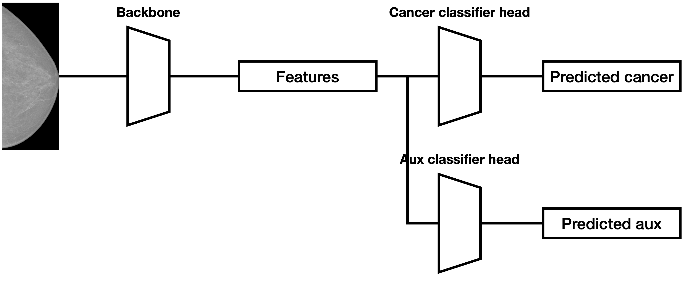
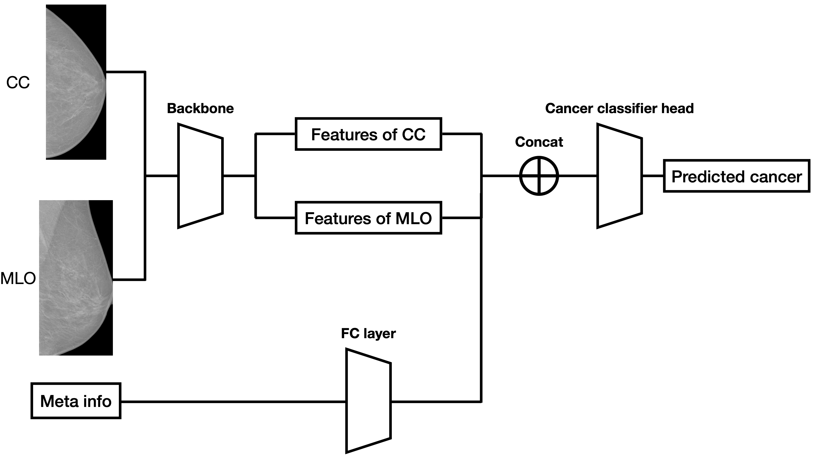
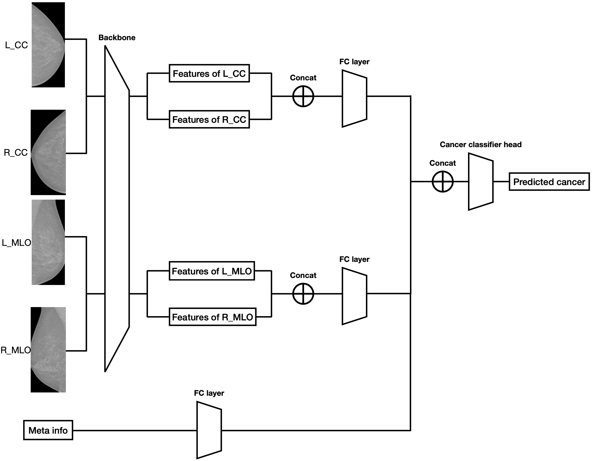

# 2nd place solution

I would like to express my gratitude to Kaggle for hosting this meaningful
competition, and to my teammates, particularly @kepenon, who persevered
alongside me throughout the entire competition.

I would like to extend my gratitude to @theoviel for providing the fast DALI
inference
notebook, which greatly aided in the completion of this competition.
Additionally, I
would like to thank @pourchot for generously sharing the external data, which
contained valuable positive case data that contributed to the success of our
final solution.

Fortunately, our team was able to get 2nd place, and I am excited to share our
approach.

## Summary of our approach

### Stages

1. Pretrain a single view model in 1280x1280 resolution with external dataset (Thanks
   to
   @pourchot, [Dataset](https://www.kaggle.com/competitions/rsna-breast-cancer-detection/discussion/377790))
2. Fine-tune the single view model in 1536x1536 resolution without external dataset
3. Use the fine-tuned single view model to further fine-tune a dual view model
   and a four view model

### Model

* ConvnextV1 small (from mmclassification)

## 1. Data preparation

* We performed manual annotation of the bounding box for the target breast in
  approximately 300 images. Subsequently, we trained a basic Faster R-CNN model
  to crop all the breast regions for the subsequent stages of training.
    * When annotating the bounding box, our aim was to refine the size of the
      box, with the intention of directing the focus of the subsequent stage
      model more precisely on the breast region. More specifically, our approach
      involved minimizing the bounding box to exclude the nipple and other
      extraneous body parts
* Use trained Faster R-CNN to crop external dataset

## 2. Data augmentation

1. `ShiftScaleRotate` from albumentation
    * We assumed that the model detects cancer based on the tissue or texture of
      the image. Therefore, it should be safe to rotate the image at any angle.
2. RandomFlip from mmcls
3. RandAugment from mmcls
4. RandomErasing from mmcls

## 3. Model

Backbone: ConvnextV1 small

### Single view model

#### Loss

1. Cancer: EQL loss [link](https://github.com/Ezra-Yu/ACCV2022_FGIA_1st)
2. Aux Loss with weight 0.1:
    1. BIRADS: EQL loss
    2. Density: EQL loss
    3. Difficult_negative_case: EQL loss, only for negative case
    4. View: CE loss
    5. Invasive: CE loss, only for positive case

### Dual view model

Meta Info: age, implant, machine_id

### Multi laterality dual view model

## 4. Train

* Optimizer: AdamW
* lr: 0.00015
* Scheduler: CosineAnnealingLR
* Epochs: 24
* Batchsize: 192
    * Large batchsize is important in our experiments to get better performance
      and stable training results
* EMA

## 5. Submission

### Ensemble (Not used)

During our discussion on final submission methods, two approaches were
considered:

1. Utilizing a single model with high resolution, without the use of an
   ensemble.
2. Using ensemble with lower resolution.

Ultimately, our team concluded that resolution plays a crucial role in detecting
cancer, leading us to choose the first option of using a single model with high
resolution.

### About cropping

After fine-tuning the model using the original images without cropping, there
was a slight improvement in the score and it remained stable. This suggests that
the size of the breast may play a role in cancer detection. Taking this into
account, our team decided not to crop the images for final submission.

### TTA
* Diagonal flip

### Best submission results of each model

Our team has limited computational resources, and we only trained with five
folds at the beginning of the competition. However, upon discovering that the
scores obtained from fold 0 exhibit a strong correlation with both
cross-validation and leaderboard results, we decided to solely focus our
experimentation on this particular fold. Therefore, we only have pf1 score for
fold 0 locally.

| Model                            | External Data | Fold 0 score                                | Public LB | Private LB |
|----------------------------------|---------------|---------------------------------------------|-----------|------------|
| SingleView(2nd stage fine-tuned) | No            | 0.42~44(calculated by each image)           | 0.57      | 0.51       |
| SingleView(2nd stage fine-tuned) | Yes           | 0.44~0.45(calculated by each image)         | 0.58      | 0.53       |
| DualView                         | Yes           | 0.55~0.56(calculated by each prediction_id) | 0.57      | 0.52       |
| MultiLateralityDualView          | Yes           | -                                           | 0.52      | 0.53       |

After careful evaluation, our team has selected the second SingleView model and
the DualView model due to their higher Public LB score and Fold 0 score.

The MultiLateralityDualView model, on the other hand, aims to compare the left
and right breasts when detecting cancer. We noticed that the image style varies
significantly with machine IDs, but for a particular patient, the image style
remains the same. Additionally, most patients only have cancer on one side of
the breast. Therefore, we believed it would be more logical to enable the model
to compare the left and right sides to predict cancer.

Unfortunately, we came up with this idea towards the end of the competition, and
there was insufficient time to optimize and tune the model. As a result, we
trained a model with the complete dataset and submitted it. However, we believe
that the MultiLateralityDualView model still holds potential for future research
and development.

## What works

* ConvnextV1
* EQL loss
* High resolution
* Large batchsize
* Auxiliary loss
* More training epochs
* External dataset for 1st stage pretraining
* MultiLateralityDualView?(Holds potential in our opinion)

## Not work for us
* Train models with external dataset at 2nd stage
* Concat cropped image horizontally
* Rule-based crop with cv2
* Upsample dataset
* Effcientnet, SE-ResNext, SwinTransformer
* Mixup augmentation
* Max pooling
* Lion optimizer
* BIRADS, density pseudo label
* Train models by machine id
* SWA? (Neither a reduction in the local score nor any improvement)
* DualView? (Minor reduction in the Public LB score)

## Solution code

We have made our code publicly available.

* [Code](https://github.com/ShuzhiLiu/RSNABreast2ndPlace)
* [External data](https://www.kaggle.com/competitions/rsna-breast-cancer-detection/discussion/377790)

The code includes a single view model, which has demonstrated strong performance
with a Private
Leaderboard score of 0.53. Furthermore, the results obtained with this model can
be reliably reproduced using a single RTX 3090.

## Acknowledgement

We would like to express our gratitude to the Kaggle support system and the emotional support of Rist inc. 
